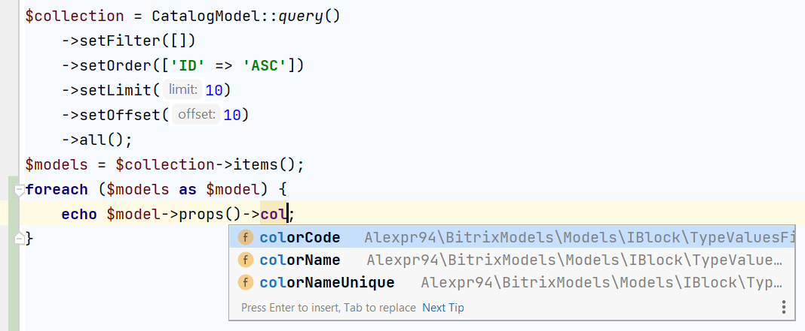

Bitrix models
======
## Описание
Данный пакет привносит слой модели(Model Layer) и позволяет сгенерировать классы 
моделей для основных сущностей CMS Bitrix, таких как инфоблоки, разделы инфоблоков, 
highload-блоки и пользователи. 

При генерации моделей пакет автоматически считывает все существующие пользовательские поля 
и свойства сущности Битрикс и на их основе создает специальные типы классов
с набором таких же пользовательских полей и свойств, как в Вашей базе 
данных в lowerCamelCase формате.

В результате Вам предоставляется возможность использовать встроенную в редактор кода(IDE) 
систему подсказкок возможных полей и свойств класса.



## Установка

```bash
composer require alexpr94/bitrix-models
```

## Генерация моделей для инфоблоков

Для генерации модели инфоблока создайте скрипт по примеру ниже, отредактируйте параметры 
конструктора генератора IBlockGenerator согласно Вашим требованиям, указав необходимый 
символьный код инфоблока, namespace будущих сгенерированных классов и их пути сохранения. 
Далее выполните скрипт. После выполнения скрипт можете удалить.

```php
use Alexpr94\BitrixModels\Generator\Models\IBlockModels\IBlockGenerator;

require($_SERVER['DOCUMENT_ROOT'] . '/bitrix/header.php');

$pathSaving = $_SERVER['DOCUMENT_ROOT'] . '/local/classes/IBlockModels';
$namespace = 'Classes\\IBlockModels';
$codeIblock = 'catalog';

$generator = new IBlockGenerator($codeIblock, $pathSaving, $namespace);
if (!$generator->generate()) {
    var_dump($generator->getErrors());
}
```

Генератор кода по указанным путям создаст php-файлы классов, которые будут содержать все 
поля и пользовательские свойства элементов/разделов указанного инфоблока, 
что даст Вам возможность через подсказки редактора кода(IDE) быстро выбирать необходимые 
свойства и поля елементов/разделов при написании кода вашего приложения. Все классы будут начинаться 
с названия символьного кода инфоблока в CamelCase формате.

#### Пример структуры сгенерированных файлов для инфоблока товаров с символьным кодом catalog:

* IBlockModels/Catalog/CatalogModel.php - модель для выборки элементов
* IBlockModels/Catalog/CatalogSectionModel.php - модель для выборки разделов
* IBlockModels/Catalog/Overrides/CatalogElementQuery.php - переопределение базового класса запроса ElementQuery
* IBlockModels/Catalog/Overrides/CatalogModelCollection.php - переопределение базового класса коллекции BaseModelsCollection
* IBlockModels/Catalog/Overrides/CatalogPropsData.php - переопределение базового класса свойств элемента IBElementPropsData
* IBlockModels/Catalog/Overrides/CatalogSectionModelCollection.php - переопределение базового класса коллекции BaseModelsCollection
* IBlockModels/Catalog/Overrides/CatalogSectionPropsData.php - переопределение базового класса свойств раздела IBSectionPropsData
* IBlockModels/Catalog/Overrides/CatalogSectionQuery.php - переопределение базового класса запроса SectionQuery

Для работы вы должны использовать два класса: CatalogModel и CatalogSectionModel.
Все классы в папке Overrides/ переопределяют базовые системные классы по работе с моделями и
напрямую не должны создаваться через оператор new.
Эти переопределения необходимы для корректной работы системы подсказок редактора кода(IDE)
при написании кода Вашего приложения.

## Генерация моделей для highload-блоков

Пример кода для генерации моделей highload-блоков:
```php
use Alexpr94\BitrixModels\Generator\Models\HLModels\HLModelGenerator;

require($_SERVER['DOCUMENT_ROOT'] . '/bitrix/header.php');

$hlCodes = [
    'WarehouseOrders',
    'Regions',
    'HistoricityFieldsOrder'
];
$pathSave = $_SERVER['DOCUMENT_ROOT'] . '/local/classes/HLModels/';
$namespace = 'Classes\\HLModels';

foreach ($hlCodes as $hlCode) {
    $generator = new HLModelGenerator($hlCode, $pathSave, $namespace);
    if (!$generator->generate()) {
        var_dump($generator->getErrors());
    }
}
```
Укажите массив кодов highload-блоков, для которых нужны модели, и необходимые другие 
параметры конструктора класса HLModelGenerator.

#### Пример структуры сгенерированных файлов для highload-блока с кодом Regions:

* HLModels/Regions/RegionsModel.php - модель для выборки записей
* HLModels/Regions/Overrides/RegionsCollection.php - переопределение базового класса коллекции BaseModelsCollection
* HLModels/Regions/Overrides/RegionsQuery.php - переопределение базового класса запроса для таблиц DataManagerQuery

## Генерация модели для пользователей

```php
use Alexpr94\BitrixModels\Generator\Models\UserModels\UserModelGenerator;

require_once($_SERVER['DOCUMENT_ROOT'] . '/local/php_interface/include/header.php');

$generator = new UserModelGenerator($_SERVER['DOCUMENT_ROOT'] . '/local/classes', 'Classes');
$generator->generate();
if (!empty($generator->getErrors())) {
    var_dump($generator->getErrors());
}
```

#### Cтруктура сгенерированных файлов для пользователей:

* User/UserModel.php - модель для выборки записей
* User/Overrides/UserModelsCollection.php - переопределение базового класса коллекции UserModelsCollection
* User/Overrides/UserPropsData.php - переопределение базового класса свойств пользователей UserPropsData
* User/Overrides/UserQuery.php - переопределение базового класса запроса UserQuery

## Использование моделей

#### Выборка моделей:

Для выборки данных у всех сгенерированных моделей вне зависимости от типа сущности имеется 
статический метод query(), возвращающий класс 
построителя запроса. В классе построителя запроса вы можете устанавливать поля и свойства для выборки, 
устанавливать фильтры, сортировку, параметры постраничной навигации и т.д.

Пример выборки разделов:

```php
$collection = CatalogSectionModel::query()
    ->setMethodGettingRecordInLoop(BaseIBlockQuery::METHOD_GETTING_FETCH)
    ->setOrder(['ID' => 'ASC'])
    ->setNPageSize(10)
    ->setINumPage(10)
    ->all();
$models = $collection->items();
foreach ($models as $model) {
    var_dump($model->fields);
    var_dump($model->props());
}
```

Метод all() построителя запросов возвращает объект коллекции моделей.

Для выборки одной модели вместо метода all() можете использовать метод one(), который вернет вам сразу
экземпляр модели:

```php
$model = CatalogSectionModel::query()
    ->setMethodGettingRecordInLoop(BaseIBlockQuery::METHOD_GETTING_FETCH)
    ->setOrder(['ID' => 'ASC'])
    ->setFilter(['ID' => 16])
    ->one();
var_dump($model->fields->xmlId);
```

Метод setMethodGettingRecordInLoop() построителя запроса необходим для указания метода выборки данных Битриксом.
Возможные значения параметра метода:
* BaseIBlockQuery::METHOD_GETTING_FETCH - 'Fetch'
* BaseIBlockQuery::METHOD_GETTING_GET_NEXT - 'GetNext'
* BaseIBlockQuery::METHOD_GETTING_GET_NEXT_ELEMENT - 'GetNextElement'

#### Сохранение модели для highload-блока:

Для highload-блока используйте метод save() экземпляра модели.

#### Сохранение моделей для инфоблоков, разделов и пользователей:

В связи со сложной структурой хранения этих сущностей в БД в плане производительности решено для этих моделей 
оставить метод save() нереализованным. В них метод save() содежит код-заглушку, возвращающий false. 
Вы можете переопределить этот метод на Ваше усмотрение.

#### Удаление модели:

Для удаления у всех моделей имеется метод delete().

[](https://yoomoney.ru/to/4100118555955341)
*Если вы считаете этот проект полезным, пожалуйста, рассмотрите возможность 
сделать пожертвование. Любые пожертвованные средства будут использованы 
для дальнейшего развития этого проекта.)
[Пожертвовать](https://yoomoney.ru/to/4100118555955341)*